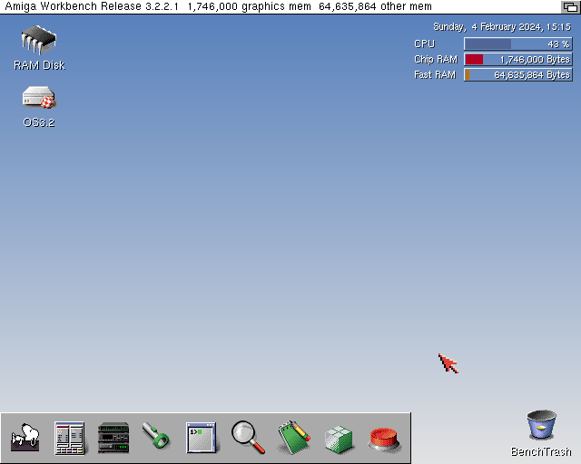

# BestClassicWB

BestClassicWB is an enhancement pack for the AmigaOS v3.2.2.1, which is based on the original [ClassicWB](https://classicwb.abime.net/) distribution.  
It provides a pre-configured Workbench environment, includes a large selection of pre-installed software and utilities, and is designed to be easy to use for beginners and advanced users alike.

## Features

- Based on the original ClassicWB distribution
- GlowIcons included in the original ClassicWB, plus DefIcons icons
- Extra datatypes
- Extra libraries including PeterK icon.library
- Additional commodities/utilities in WBStartup
- FBlit, FText
- MUI
- Miami
- Other useful programs such as DOpus, WHDLoad + iGame, Eagleplayer, Delitracker, PPaint, WBDock
- More...

## Requirements

- An AGA Amiga (1200/4000) with an accelerator and some RAM, or a similar WinUAE setup.
- A clean install of AmigaOS 3.2.2.1

## Installation

- Download `BestClassicWB.zip` from the latest [releases](https://github.com/kouts/best-classic-wb/releases).
- Copy the archive to your Amiga and unzip it either in RAM Disk or in a separate partition if it's available.
- Double click on the BCWB icon.

## Thanks to

`Bloodwych` for creating ClassicWB (http://classicwb.abime.net/).  
`Gulliver` for creating BestWB and also for all the help (http://lilliput.amiga-projects.net/BestWB.htm).  
`KKR75` for providing icons.

## The idea

BestClassicWB was created primarily because I wanted to have the AmigaOS 3.9 style icons look in AmigaOS 3.2 and I also wanted to have a pre-configured environment with some useful programs and utilities.  

It has taken inspiration from [ClassicWB](https://classicwb.abime.net/) and [BestWB](http://lilliput.amiga-projects.net/BestWB.htm), but it's not a direct replacement for either of them, 
meaning it doesn't have exactly the same features or programs.

BestClassicWB overwrites files upon installation, so it's recommended to install it on a clean AmigaOS.
Because each release contains all the files that are going to be installed, you have to have in mind that changes that
you did to the system will be lost if you install a new version. If you want to keep BestClassicWB updated, you can
have an additional script that copies your changes to the new installation, that's how I'm handling it personally.

## How to contribute

I would like to keep BestClassicWB as minimal as possible so I don't plan to add additional programs or features unless there's a really good reason to do so.
If you want to contribute to BestClassicWB, you can do so by creating an issue or a pull request.
If you are adding a new program, you have to include an icon in AmigaOS 3.9 style format, and if you are adding a new feature, it has to be something that is really useful and not just a personal preference.
Sometimes new versions of programs are not always better, so we will have to evaluate each case. The target Amiga spec for BestClassicWB is A1200/030 with some fast RAM, so any changes proposed should be tested on that (or similar) configuration and make sure that it doesn't slow down the system.